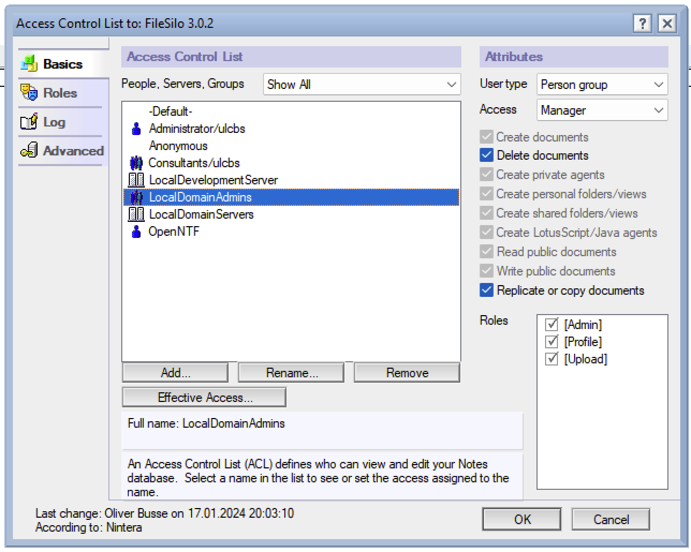
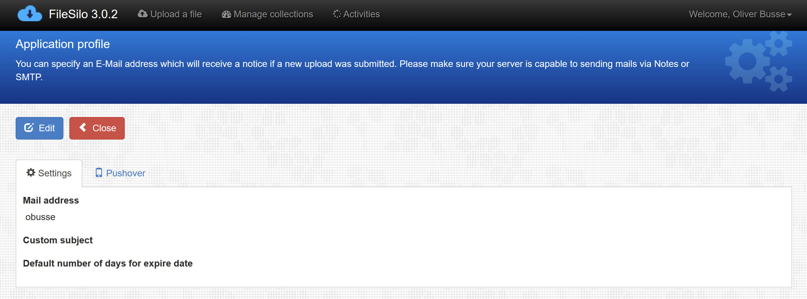

# Setup

## Building the application

There are two options to get FileSilo:

- Load the NTF template from the repository and create a new HCL Notes application with it. You can find the current template in the folder `ntf` of this repository.
- clone the repository and build your own NSF from the ODP in the repository using Domino Designer

## ACL

The recommended ACL settings are:

| User/Group                   | Type         | Level   | Roles              |
| ---------------------------- | ------------ | ------- | ------------------ |
| Anonymous                    | Undefined    | Reader  | [Upload]           |
| LocalDomainAdmins            | Person Group | Manager | [Admin], [Profile] |
| (Other Users/Groups/Default) | -            | Editor  | -                  |

The important role is `[Upload]`. This ensures anonymous users to upload files even though they are readers to the application. Admins should control the general settings (profile) to define options.



## Login

Click the link in the upper-right menu to login to Domino. If you are recognized as a user with the role `[Profile]`, you can also see an additional menu entry here called `Settings`.

## Settings

Settings are available only for logged-in users with the role `[Profile]`. To open the settings just click on the upper-right menu item which displays your user name and select `Settings`.

This will bring up this page:



The settings page has two tabs:

- Settings
- Pushover

### Settings

| Field                                  | Function                                                                                                                       |
| -------------------------------------- | ------------------------------------------------------------------------------------------------------------------------------ |
| Mail address                           | Specify a recipient address for notifications. A notification will be generated everytime someone uploads a new file           |
| Custom subject                         | You can define a subject and use the placeholder `<DB>` for this notification, e.g. ```A new file has been uploaded to <DB>``` |
| Default number of days for expire date | An anonymous file upload automatically has a expiry date. This defines this date by the number of days from the current date   |

### Pushover

If you happen to have an account on Pushover, you can provide the API data here. Using Pushover enables FileSilo to send push notifications to a mobile device after an upload was performed.

The fields are self-explanatory and define all parts for utilizing Pushover.

The option `For anonymous uploads only` allows you to also get notifications when an upload was performed by a logged-in user.
