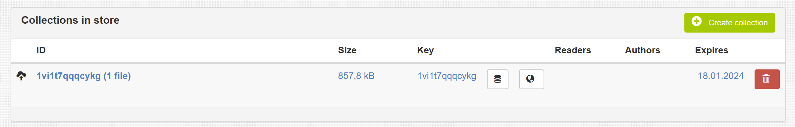
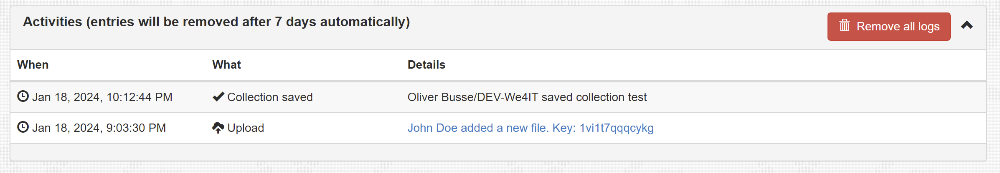

# Using FileSilo

## Logged-in User

### Upload

The logged-in user has more options to work with FileSilo. However, the simple upload part is identical as for the anonymous user.

### Creating a collection

The main task for the authenticated user is to provide file collections for customers, usually anonymous users. Using the button `Create Collection` will provide you with the collection form.

The form provides four sections to define the collection and fields:

| Section        | Field        | Function                                                                                                                                     |
| -------------- | ------------ | -------------------------------------------------------------------------------------------------------------------------------------------- |
| General        | ID           | Basically just a name for the collection                                                                                                     |  |
|                | Customer key | Unique key which you tell the customer to access this collection later. You can have FileSilo generate an ID for your by clicking the button |
|                | Attachments  | Click this button to add files to your collection                                                                                            |
| Decription     | Decription   | Richtext to describe this collection                                                                                                         |
| Access Control | Readers      | Readers for this collection                                                                                                                  |
|                | Authors      | Authors for this collection                                                                                                                  |
| Expire  date   | Expires      | The collection will expire i.e. be deleted at this date. Keeps the app neat and tidy                                                         |

!!! warning "Hint"
    There is a bug with the richtext editor in combination with Bootstrap 3 theming when the control is not visible at page load. The input area then is not visible by default. To fix this, click the `Source` button in the toolbar twice to make it visible

!!! danger "Attention"
    Due to a bug in newer versions of Domino in combination with the built-in Bootstrap 3 library, the readers and author fields are not available since the name picker icon is not visible

### Manage Collections

This page provides an overview of all collections in FileSilo. You can open to edit or remove them. The list displays some details like the expiry date.

### Activities

This page is basically a log of all activities. It displays a timestamp, the action (what happened) annd the user information. With anonymously uploaded files you also get a link to this upload from this view level.

You can also remove all logs by clicking the red button.

