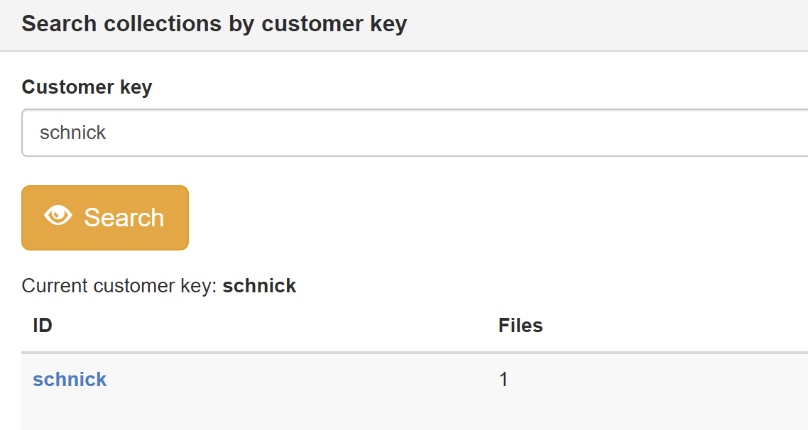
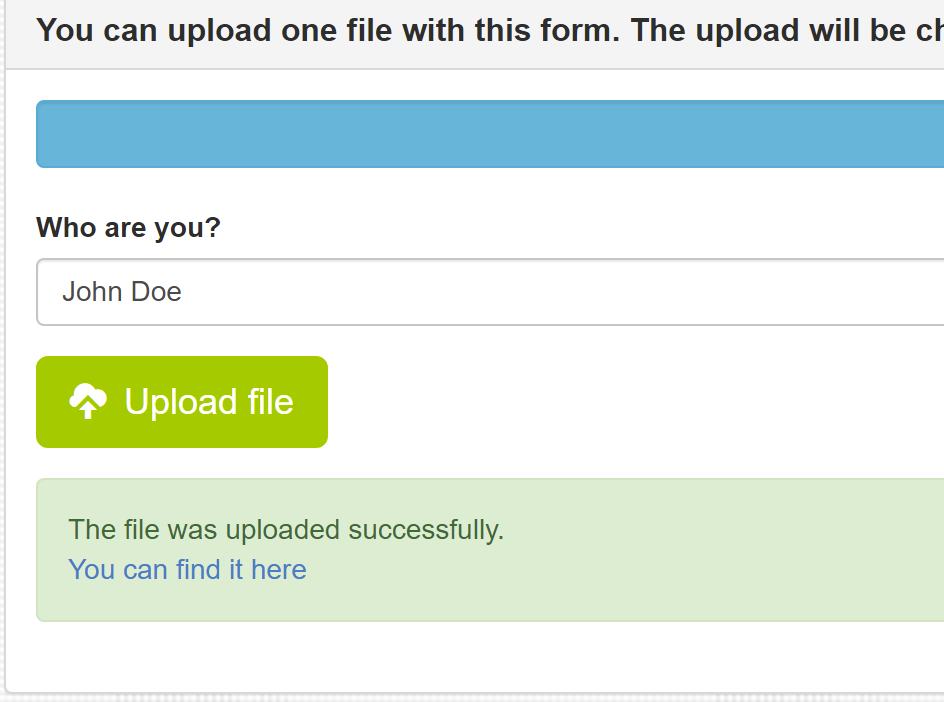
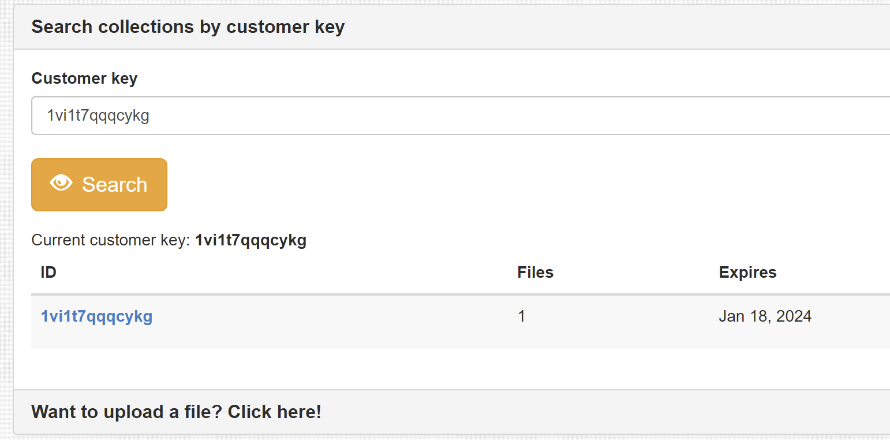

# Using FileSilo

## Anonymous Usage

### Download

The primary use case here is to provide a single file or a collection of files to the user. The only thing needed to access the file(s) is a so called unique customer key. This must be provided to the user before. The user then just can search for this key on the start page. If the collection was found, it will be diplayed below the search field.

!!! info
    Pleaase make sure you use complex keys that are not easy to guess

### Upload

FileSilo can provide a simple upload interface for the anonymous user. This obviously depends on if you set the ACL for the anonynous user to read access. If not, then this option is not available.

The anonymous user can upload a file by clicking `Upload` in the menu bar. The inly options in this form is the file field and a text field to specify some free text, usually this would be a customer name and/or other info to identify the upload.

After the upload was successfully done, it can be accessed with the link displayed below the form.

By clicking this link the user can see the upload and some details:

If configured properly, a notification is sent when a new file was uploaded. Checkout [the setup documentation](setup.md#settings) to configure the address.